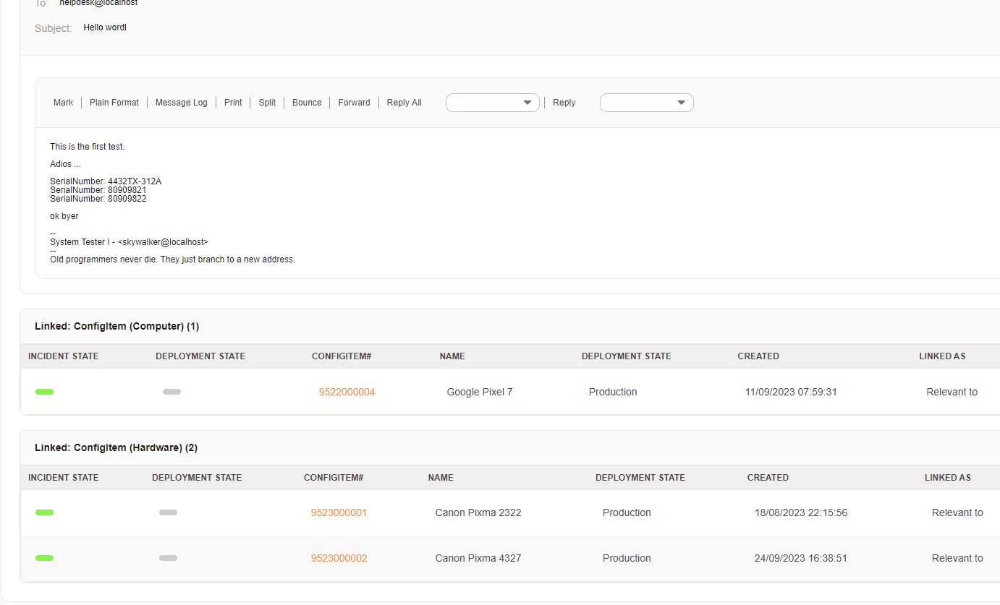

# Znuny-ConfigItem-SerialNumber-Postmaster-Filter
 Recognize serial number in mail body and set dynamic field config item.

1. You should have a ticket dynamic field (Config Item) predefined in your system

		E.g: 
		Name: RelatedComputer
		Field Type: Config item (multiselect)
		Config Item Class: Computer
		Config Item Deployment State: Any
		Config Item Link Type: Any
		Config Item Link Source: Any
		
		Name: RelatedHardware
		Field Type: Config item (multiselect)
		Config Item Class: Hardware
		Config Item Deployment State: Any
		Config Item Link Type: Any
		Config Item Link Source: Any
	
		*Advisable to use multi select as this will allow multiple serial number in the email body.
	
	
2. Go to Admin > System Configuration > PostMaster::PreFilterModule###5-ConfigItemSNRecognition

	Update the DynamicField section.
	
		E.g:
		
		RelatedComputer => Computer
		RelatedHardware => Hardware
		
		*where RelatedComputer and RelatedHardware is dynamic field config item name.
		*where Computer and Hardware is Config Item class which the dynamic field belong to.
		
		
3. Email example

		From skywalker@localhost  Fri Dec 21 23:59:24 2001
		Return-Path: <skywalker@otrs.org>
		Received: (from skywalker@localhost)
			by avro.de (8.11.3/8.11.3/SuSE Linux 8.11.1-0.5) id f3MMSE303694
			for skywalker@localhost; Fri, 21 Dec 2001 23:59:24 +0200
		Date: Fri, 21 Dec 2001 23:59:24 +0200
		From: System Tester I <skywalker@otrs.org>
		To: helpdesk@localhost
		Subject: Hello wordl
		Message-ID: <20011221002814.A3599@avro>
		Mime-Version: 1.0
		Content-Type: text/plain; charset=us-ascii
		Content-Disposition: inline
		X-Operating-System: Linux 2.4.10-4GB i686
		X-Uptime: 12:23am  up  5:19,  6 users,  load average: 0.11, 0.13, 0.18
		Content-Length: 139
		Lines: 11
		
		This is the first test.
		
		Adios ... 
		
		SerialNumber: 4432TX-312A
		SerialNumber: 80909821
		SerialNumber: 80909822
		
		ok byer
		
		--
		System Tester I - <skywalker@localhost>
		--
		Old programmers never die. They just branch to a new address.

4. If found, the id of the config item will be update into the dynamic field config item. 
   If configured as number 1, ticket will auto link with the Config Item.
   

